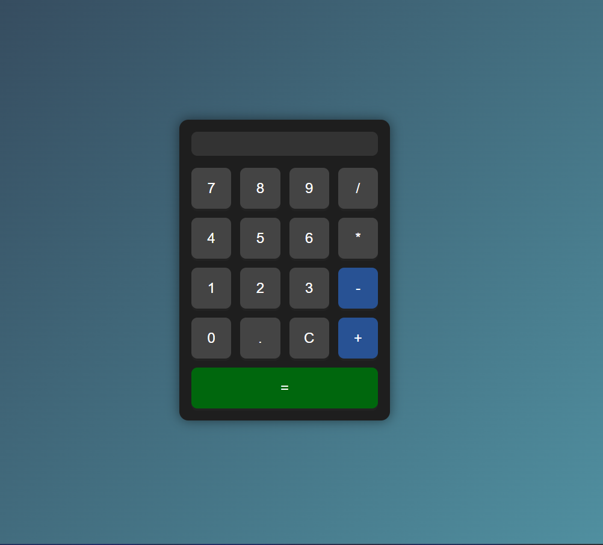

🧮 A Simple, Interactive Calculator for Basic Arithmetic
MyCalculator is a web-based calculator that performs essential arithmetic operations like addition, subtraction, multiplication, and division. It's designed to be user-friendly and responsive, suitable for anyone needing quick calculations.

🚀 Features
Basic Operations: Add, subtract, multiply, and divide.
Clear Function: Reset calculations easily with the "Clear" button.
Responsive Design: Works seamlessly on different screen sizes.
Interactive Buttons: Each button offers immediate feedback for a smooth experience.
🛠️ Tech Stack
HTML - Structure and layout
CSS - Styling and design
JavaScript - Core functionality and operations
🔧 Installation
1. Clone this repository:
git clone https://github.com/carlosazevedodev/mycalculator.git

2. Open index.html in a browser to use the calculator.
💡 How to Use
Open index.html in any browser.
Input numbers and choose operations using the buttons.
Press = to get the result, and C to clear.

📷 Screenshot:

🎉 Contributions and Feedback
If you have feedback or suggestions, feel free to open an issue or pull request.

